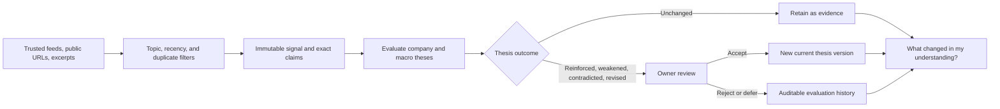
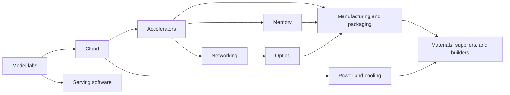

# Relay

Relay is a personal, versioned thesis system for the AI-infrastructure stack.
It watches a small set of trusted sources, preserves their exact claims as an
immutable evidence ledger, and evaluates whether that evidence changes a
company or macro infrastructure thesis.

Relay is deliberately not a filing vault, PDF archive, generic news reader,
portfolio tracker, or document-management system. Most incoming items should be
classified as **not material** or reinforce the current mental model without
changing it. A daily brief with “No meaningful change” is a successful result.

The core product question is:

> **What thesis did this update?**

Articles and signals provide provenance; they are not the end product. Relay's
primary output is a small set of reviewable changes to the owner's understanding
of the stack.

## Product loop



Relay deliberately separates source analysis from thesis evaluation:

1. **Signal** — an immutable record of the source, exact quotes verified against
   normalized source paragraphs, and source-level classification.
2. **Thesis** — a durable company or macro claim with confidence, unknowns,
   and explicit strengthening and weakening conditions.
3. **Evaluation** — a model-proposed outcome that cites supplied claims and
   explains the evidence-to-thesis reasoning.
4. **Review** — an owner decision to accept, reject, or defer the proposal.
5. **Version** — the new current thesis state created only when an accepted
   evaluation actually changes the thesis.

Valid evaluation outcomes are `unchanged`, `reinforced`, `weakened`,
`contradicted`, and `revised`. Relay does not force every signal to update a
thesis. Confidence can move by at most 10 points per evaluation, and a revision
to thesis text requires evidence from at least two independent source
provenances. The model proposes changes; it never silently rewrites the current
thesis.

## Product surfaces

- **Today** answers “What changed in my understanding?” It separates the
  largest thesis update from evidence that accumulated without changing a
  thesis, and treats “No meaningful change” as a first-class outcome.
- **Theses** (`/theses`) is the primary workspace. Company and Macro tabs show
  the current thesis, confidence, evidence counts, and pending-review count.
  `/theses/:beliefId` shows supporting, opposing, and contextual evidence;
  unknowns; strengthening and weakening conditions; pending evaluations; and
  accepted version history.
- **Signals** (`/signals`) is the source-derived evidence ledger. It
  remains inspectable for provenance and review without being the product
  center.
- **Briefs** keeps a dated archive of mental-model conclusions with their
  underlying thesis evaluations, signals, and exact evidence citations.
- **Sources** shows trusted-source health, refreshes enabled public feeds,
  identifies every item handled by the latest refresh, accepts public article
  URLs and manually pasted excerpts, and lets the owner add or remove feeds.
- **Search** remains available through `Cmd+K` / `Ctrl+K` and a dedicated route,
  but searches only theses, signals, exact evidence, and briefs—not raw source
  text.

The stack map remains available as context linking macro and company theses to
the infrastructure dependency graph. Legacy `/beliefs` and `/companies` routes
redirect to `/theses`.

## Managing your tracker

Relay starts with a focused AI-infrastructure watchlist, six macro theses, and
a trusted-source catalog:

- Use **Theses → Add company thesis** to define a company, infrastructure
  layers, current thesis, confirmation criteria, disconfirming criteria, watch
  metrics, and initial confidence. Selecting any thesis opens its full detail.
- Use **Remove thesis** on a company thesis detail page to take it off the active
  watchlist.
  Relay archives the company instead of deleting historical signals or evidence.
- Use **Sources → Add automated feed** to add an RSS, release, or research
  feed. Added feeds participate in the same normalization, deduplication,
  topic filtering, and analysis pipeline as built-in automated feeds.
- Use **Add trusted website** to register a non-feed publisher or company
  domain with its source role, authority tier, infrastructure layers, affected
  companies, and macro theses. Relay does not crawl these profiles
  automatically.
- Use the remove control on any source to stop tracking it. The source is
  archived so previously imported evidence keeps valid provenance.
- Use **Add signal** for a public article URL or a permitted pasted excerpt.
  Relay leaves a persistent success or error result after the dialog closes;
  successful analysis includes a direct **View signal** link.

Use a source row's **Refresh** control to check one automated feed, or
**Refresh all** to check every enabled feed. The result ledger names every feed item Relay handled and
marks it as **New**, **Analyzed**, **Already tracked**, or **Error**. Analyzed
items link directly to their evidence record, so aggregate counts such as “1
new, 1 analyzed” always map back to a specific title and source.

A source is a repeatable provenance and trust profile. A signal is one analyzed
piece of evidence from a feed item, public page, or permitted excerpt. Sources
control intake, attribution, and coverage; signals are evaluated against theses
and cited by briefs. Signals can be deleted unless an accepted thesis version
depends on them.

## Thesis evaluation and review

Thesis evaluation is intentionally a separate, manual operation. Refreshing or
adding a source records evidence; it does not silently change a thesis. The
current API workflow is:

```bash
# Optionally reclassify and queue one existing signal first.
curl -X POST \
  http://127.0.0.1:8787/api/updates/UPDATE_ID/requeue-thesis-evaluation

# Evaluate evidence added since the latest evaluation batch.
curl -X POST http://127.0.0.1:8787/api/theses/evaluate

# Inspect the resulting proposal in GET /api/theses/:id, then decide it.
curl -X POST \
  -H 'Content-Type: application/json' \
  -d '{"decision":"accepted","note":"Evidence clears the change threshold."}' \
  http://127.0.0.1:8787/api/thesis-evaluations/EVALUATION_ID/review
```

Signal analysis explicitly dispositions every active macro thesis as
**primary**, **secondary**, **context**, or **not relevant** using the exact
thesis text and cited claims—not publisher names or layer overlap alone. Primary
and secondary signal-to-thesis routes must appear in the resulting thesis
evaluation, even when the correct outcome is **unchanged**. Context evidence can
inform an evaluation but cannot change thesis confidence by itself. This makes
macro routing inspectable and prevents relevant signals from disappearing
silently between ingestion and evaluation.

**Queue thesis re-evaluation** preserves accepted thesis history, supersedes
only pending or deferred proposals linked to that signal, and places it in the
next **Evaluate theses** run. Older signals that predate macro routing are first
classified from their stored summaries and exact claims.

Reviews accept `accepted`, `rejected`, or `deferred`. Accepting a changed
evaluation transactionally creates a new thesis version and links its exact
evidence into the durable ledger. Accepting an `unchanged` evaluation records
the decision without creating a redundant version. Rejected and deferred
proposals remain auditable, and stale proposals cannot overwrite a thesis that
has advanced since they were created. Deferred proposals move out of the
pending queue, are excluded from brief synthesis, and remain available to
accept or reject later.

The **Material** and **Not material** controls review one proposed thesis impact,
not the source or the entire signal. Material keeps that impact eligible for
future thesis evaluation and briefs. Not material excludes the impact while
retaining the signal for other valid impacts or contextual evidence.

After evaluation and review, use **Generate understanding readout** on Today. The
**Briefs** route preserves prior dated conclusions, their underlying
evaluations and signals, and stored evidence citations.

## Source strategy

Source definitions live in one authoritative registry:
`src/server/ingestion/source-registry.ts`. Each definition records its role,
authority tier, intake mode, fetch strategy, priority, per-refresh quota,
coverage, allowed domains, and topic rules.

### Automated public feeds

- The Next Platform for cross-layer systems and accelerator infrastructure
- TrendForce Semiconductors for HBM, memory supply, and advanced packaging
- Dell’Oro for data-center networking and optical interconnects
- Data Center Dynamics and Utility Dive for data-center power, cooling, grid,
  transformer, and interconnection constraints
- vLLM, SGLang, TensorRT-LLM, and NVIDIA Dynamo release feeds
- ServeTheHome and Chips and Cheese as lower-priority architecture context
- arXiv `cs.DC`, behind AI-infrastructure topic, recency, and low-signal filters

Refresh fetches every enabled feed before choosing candidates. It applies
per-source quotas, topic filters, and round-robin selection. Serving-software
releases share a two-item refresh cap, while automated context sources share a
one-item cap. This keeps those useful streams without allowing them to crowd out
memory, networking, optics, power, and manufacturing evidence.

### Public URL sources

Public pages from the watchlist company newsrooms and investor-relations sites,
SemiAnalysis public posts, LightCounting, TrendForce / DRAMeXchange, Dell’Oro,
Data Center Dynamics, Utility Dive, Samsung Memory, SK hynix, and TSMC
advanced-packaging coverage can be submitted through **Add signal**.
Relay uses hardened, credential-free public URL fetching and never bypasses
access controls.

### Manual context

Paid or contextual material remains explicitly manual. Paste only excerpts you
are authorized to process from sources such as SemiAnalysis paid research, The
Information, Stratechery, Latent Space, Dylan Patel interviews, Fabricated
Knowledge, Chips and Cheese, or ServeTheHome.

Relay does not implement authenticated scraping, paywall bypassing, PDF upload,
OCR, SEC crawling, Twitter/X ingestion, or generic stock-news collection.

### Macro thesis coverage audit

**Sources** shows an explicit coverage result for each macro thesis:

- **Automated** — at least one active first-party or specialist primary feed.
- **Manual only** — strong first-party or specialist sources are configured,
  but none is an active feed.
- **Missing** — no strong mapped source is configured.

Context sources remain visible in the audit but never satisfy coverage on their
own. The same status appears on macro-thesis cards and detail pages. The mapping
is explicit and reviewable in `src/server/ingestion/source-coverage.ts` rather
than inferred from broad keyword overlap.

## Daily brief

The daily brief is a mental-model readout, not a news summary. It prioritizes:

- accepted thesis changes,
- pending changes clearly labeled as proposals,
- confidence movement and contradictions,
- multi-source synthesis when independent evidence chains converge, and
- evidence that was evaluated without changing the current thesis.

Brief generation considers only evidence and evaluations in the current brief
window. Code-level eligibility excludes unsupported claims and rejected
proposals. The synthesis model can select only supplied evaluation, signal, and
evidence-claim IDs, and Relay validates every returned reference before
persistence.

If nothing clears the threshold, Relay creates a deterministic “No meaningful
change” brief without making an OpenAI synthesis request. The underlying
evidence remains available for future comparison. Each dated brief and its
evaluation links remain available through the brief archive.

## Infrastructure map

Relay uses a ten-layer dependency graph:



The built-in watchlist is NVDA, AMD, AVGO, MRVL, ANET, COHR, LITE, GLW, MU,
VRT, ETN, GEV, and TSM.

## Technical architecture

- React 19, React Router, Vite, TypeScript, and Tailwind CSS 4
- Hono on the Node.js HTTP server
- Node’s built-in SQLite driver in WAL mode
- OpenAI Responses API with strict Zod structured outputs for source analysis,
  thesis evaluation, and thesis-first brief synthesis
- Mozilla Readability, RSS/Atom parsing, and hardened public URL fetching
- Vitest and ESLint

Client routes live under `src/client/routes`, reusable UI under
`src/client/features`, API and services under `src/server`, and shared contracts
under `src/shared`.

Owner-management and history APIs include:

| Method | Route | Purpose |
| --- | --- | --- |
| `GET` | `/api/theses?kind=company\|macro&status=active\|archived\|all` | List versioned theses. |
| `GET` | `/api/theses/:id` | Read current state, evidence, evaluations, and version history. |
| `POST` | `/api/theses/evaluate` | Evaluate newer evidence against active company and macro theses. |
| `POST` | `/api/thesis-evaluations/:id/review` | Accept, reject, or defer a proposed thesis update. |
| `POST` | `/api/companies` | Add or restore a company thesis. |
| `DELETE` | `/api/companies/:ticker` | Archive a company thesis. |
| `POST` | `/api/sources` | Add an RSS, release, or research feed. |
| `POST` | `/api/source-profiles` | Register a trusted non-feed website profile. |
| `DELETE` | `/api/sources/:id` | Archive a source. |
| `POST` | `/api/sources/refresh` | Refresh feeds and return per-item outcomes. |
| `POST` | `/api/sources/:id/refresh` | Refresh one automated feed. |
| `DELETE` | `/api/updates/:id` | Delete a signal unless an accepted thesis change depends on it. |
| `GET` | `/api/briefs` | List prior daily briefs. |
| `GET` | `/api/briefs/:id` | Read one persisted brief. |

SQLite remains the private system of record for source provenance, hashes,
analysis status, signals, exact claims, theses, thesis versions,
evaluation proposals and reviews, evidence links, and briefs. Raw source
records are internal provenance/cache data and are not presented as a document
library.

## Requirements and setup

- Node.js 22 or newer
- npm 10 or newer
- An OpenAI API key for live source analysis, thesis evaluation, and material
  daily synthesis

```bash
npm install
cp .env.example .env
chmod 600 .env
npm run dev
```

Open `http://127.0.0.1:5173`. The Hono API runs at
`http://127.0.0.1:8787`; Vite proxies `/api` during development.

Without an API key the seeded theses, source catalog, existing evidence, and
local search still work. New source analysis and thesis evaluation fail safely;
source-analysis failures record a sanitized error.

For the production bundle:

```bash
npm run build
NODE_ENV=production npm start
```

## Environment variables

| Variable | Default | Purpose |
| --- | --- | --- |
| `OPENAI_API_KEY` | none | Required for live source analysis, thesis evaluation, and material synthesis. |
| `OPENAI_ANALYSIS_MODEL` | `gpt-5.4-mini` | Source analysis and exact-evidence extraction model. |
| `OPENAI_THESIS_EVALUATION_MODEL` | `gpt-5.5` | Company and macro thesis-evaluation model. |
| `OPENAI_SYNTHESIS_MODEL` | `gpt-5.5` | Understanding-first daily-readout model. |
| `OPENAI_STORE_RESPONSES` | `true` | Store Responses with searchable Relay metadata in the OpenAI Platform. Set `false` for sensitive sources. |
| `HOST` | `127.0.0.1` | API bind address. Keep it on loopback without an auth/TLS boundary. |
| `PORT` | `8787` | API and production web-server port. |
| `RELAY_ALLOWED_HOSTS` | `127.0.0.1,localhost,::1` | API request-host allowlist. |
| `RELAY_REFRESH_MAX_ITEMS` | `6` | Baseline analysis budget per refresh, clamped to 1–12. Enabled-feed count may raise the ceiling, while serving and context bucket caps still limit their share. |
| `RELAY_DATABASE_PATH` | `data/relay.sqlite` | Optional local database path. |
| `RELAY_DEMO_DATA` | `false` | Opt in to clearly labeled UI fixtures. |

Model requests store their Responses and attach searchable metadata for the
Relay operation, environment, source/update or evaluation identifiers, and
brief inputs.
OpenAI retains stored Response application state for at least 30 days. Set
`OPENAI_STORE_RESPONSES=false` before processing sensitive sources that should
not appear in Platform logs. Imported text always leaves the local machine when
sent to OpenAI, so do not process material whose license or sensitivity
prohibits that use.

## Commands

| Command | Purpose |
| --- | --- |
| `npm run dev` | Run client and API in watch mode. |
| `npm run backup` | Create a verified owner-only SQLite snapshot. |
| `npm run test` | Run the Vitest suite. |
| `npm run lint` | Run ESLint with zero warnings allowed. |
| `npm run typecheck` | Run strict TypeScript checks. |
| `npm run build` | Build client and server. |
| `npm run start` | Start the compiled server. |
| `npm run check` | Run lint, type-check, tests, and both builds. |

## Local data and migrations

The default database is `data/relay.sqlite`; WAL and shared-memory sidecars may
also exist. These files, `.env`, backups, imported excerpts, and generated
analysis are ignored by Git and restricted to the current OS user.

Schema changes are additive. Existing company rows are backfilled into
version-one company theses, while macro theses are seeded independently.
Existing source documents and legacy analyses are preserved. Removed companies
and sources are archived so prior evidence remains valid, owner-added feeds
survive catalog reseeding, and new analyses record source provenance plus an
analysis version.

Create a consistent backup while Relay is running or stopped:

```bash
npm run backup
```

The command uses SQLite’s online backup API, runs `PRAGMA integrity_check`,
writes owner-only files under `backups/relay`, and never overwrites an existing
snapshot.

To intentionally reset local data:

```bash
rm -f data/relay.sqlite data/relay.sqlite-wal data/relay.sqlite-shm
npm run dev
```

## Security boundary

Relay has no login, user accounts, authorization, or TLS. Loopback is the access
boundary; do not expose it directly to a LAN or the public internet.

API writes reject cross-site requests, API requests require an allowed hostname,
and request bodies are size-limited. Public URL fetching accepts only
credential-free HTTP(S), rejects private and reserved destinations, revalidates
redirects, pins the validated public address, and limits redirects, content
types, response size, and duration.

Review [SECURITY.md](./SECURITY.md) before changing network exposure or data
handling. Never commit paid excerpts, credentials, databases, or generated local
analysis.

## Known limitations

- Refresh and brief generation are manual actions; there is no scheduler or
  background job system.
- Thesis evaluation is also manual. Refreshing or importing a source does not
  automatically evaluate or change theses.
- Feed refresh analyzes the content supplied by RSS/Atom entries. It does not
  automatically fetch every linked article.
- Public pages without reliable feeds remain manual URL sources.
- Built-in macro coverage mappings remain maintained in code. Trusted website
  profiles can extend manual macro coverage from the UI.
- Topic filtering and exact URL/content deduplication do not detect every
  semantically duplicated story.
- Company theses can be added and archived in the UI, but macro theses are
  currently seeded in code and cannot yet be created or edited in the UI.
- Pending thesis evaluations are visible in thesis detail and can be accepted,
  rejected, or deferred. Deferred proposals remain in a separate later-review
  section.
- Confidence is a reviewable heuristic score, not a calibrated probability.
- Source independence is approximated from Relay's source provenance IDs; it
  cannot prove that two publishers did not rely on the same upstream report.
- Model availability, cost, latency, and output quality depend on the configured
  OpenAI account and models.

Relay is a research thesis system, not financial advice.
