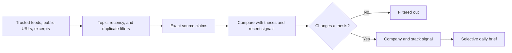
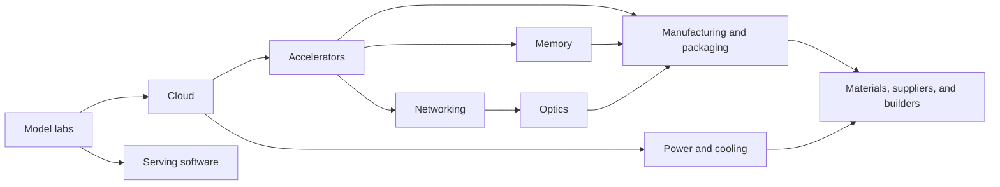

# Relay

Relay is a personal AI-infrastructure signal tracker. It watches a small set of
trusted sources, extracts exact claims, maps them to infrastructure layers and
watchlist companies, and decides whether the evidence changes an existing
thesis.

Relay is deliberately not a filing vault, PDF archive, generic news reader,
portfolio tracker, or document-management system. Most incoming items should be
classified as **not material**. A daily brief with “No meaningful change” is a
successful result.

## Product loop



For every candidate Relay separates:

1. **Evidence** — exact quotes verified against normalized source paragraphs.
2. **Classification** — affected stack layers and watchlist companies.
3. **Novelty** — new evidence, confirmation, contradiction, or repetition.
4. **Thesis delta** — the concrete change in confidence, timing, magnitude,
   bottleneck duration, or competitive position.
5. **Direction** — bullish, bearish, neutral, or not material for each affected
   company.

Repetition cannot be material. A not-material item cannot carry an actionable
thesis impact. A material signal must contain an exact evidence claim and a
concrete delta for a known watchlist company.

## Product surfaces

- **Today** shows the lead signal, concise synthesis, affected theses, and exact
  supporting evidence. It also treats “No meaningful change” as a first-class
  outcome.
- **Briefs** keeps a dated archive of prior daily conclusions with their
  underlying signals and stored evidence citations.
- **Signals** defaults to thesis-changing items. A secondary filtered-out view
  keeps noise inspectable without making it the product center.
- **Sources** shows trusted-source health, refreshes enabled public feeds,
  identifies every item handled by the latest refresh, accepts public article
  URLs and manually pasted excerpts, and lets the owner add or remove feeds.
- **Theses** contains the starting 13-company watchlist, confirmation signals,
  break conditions, watch metrics, linked signal history, and owner-managed
  company theses.
- **Search** remains available through `Cmd+K` / `Ctrl+K` and a dedicated route,
  but searches only signals, evidence, briefs, and theses—not raw source text.

The stack map remains available as contextual infrastructure for signals and
theses, rather than as a primary navigation destination.

## Managing your tracker

Relay starts with the focused AI-infrastructure watchlist and source catalog,
but both are owner-managed:

- Use **Theses → Add thesis** to define a company, infrastructure layers, core
  thesis, confirmation criteria, disconfirming criteria, watch metrics, and
  initial confidence. Selecting any thesis row opens its full detail directly.
- Use **Remove** on a thesis detail page to take it off the active watchlist.
  Relay archives the company instead of deleting historical signals or evidence.
- Use **Sources → Add source** to add an RSS, release, or research feed. Added
  feeds participate in the same normalization, deduplication, topic filtering,
  and analysis pipeline as built-in automated feeds.
- Use the remove control on any source to stop tracking it. The source is
  archived so previously imported evidence keeps valid provenance.
- Use **Add signal** for a public article URL or a permitted pasted excerpt.
  Relay leaves a persistent success or error result after the dialog closes;
  successful analysis includes a direct **View signal** link.

After **Refresh**, the result ledger names every feed item Relay handled and
marks it as **New**, **Analyzed**, **Already tracked**, or **Error**. Analyzed
items link directly to their signal, so aggregate counts such as “1 new, 1
analyzed” always map back to a specific title and source.

After **Generate brief**, use **Open brief** to go directly to the current
synthesis. The **Briefs** route preserves prior dated briefs, their underlying
signals, and any stored evidence citations.

## Source strategy

Source definitions live in one authoritative registry:
`src/server/ingestion/source-registry.ts`. Each definition records its role,
authority tier, intake mode, fetch strategy, priority, per-refresh quota,
coverage, allowed domains, and topic rules.

### Automated public feeds

- The Next Platform
- vLLM releases
- SGLang releases
- TensorRT-LLM releases
- NVIDIA Dynamo releases
- arXiv `cs.DC`, behind AI-infrastructure topic, recency, and low-signal filters

Refresh fetches every enabled feed before choosing candidates. It applies
per-source quotas and round-robin selection so a broad source such as arXiv
cannot consume the entire analysis budget.

### Public URL sources

Public pages from the watchlist company newsrooms and investor-relations sites,
SemiAnalysis public posts, LightCounting, TrendForce / DRAMeXchange, Dell’Oro,
Data Center Dynamics, and Utility Dive can be submitted through **Add signal**.
Relay uses hardened, credential-free public URL fetching and never bypasses
access controls.

### Manual context

Paid or contextual material remains explicitly manual. Paste only excerpts you
are authorized to process from sources such as SemiAnalysis paid research, The
Information, Stratechery, Latent Space, Dylan Patel interviews, Fabricated
Knowledge, Chips and Cheese, or ServeTheHome.

Relay does not implement authenticated scraping, paywall bypassing, PDF upload,
OCR, SEC crawling, Twitter/X ingestion, or generic stock-news collection.

## Daily brief

Brief generation considers only new signals since the latest brief. Code-level
eligibility excludes not-material items, unsupported claims, rejected impacts,
and impacts without a concrete thesis delta before synthesis begins.

If nothing qualifies, Relay creates a deterministic “No meaningful change”
brief without making an OpenAI synthesis request. Otherwise the synthesis model
can select only supplied update IDs and evidence claim IDs, and Relay validates
every returned reference before persistence. Each dated brief remains available
through the brief archive.

## Infrastructure map

Relay uses a ten-layer dependency graph:



The built-in watchlist is NVDA, AMD, AVGO, MRVL, ANET, COHR, LITE, GLW, MU,
VRT, ETN, GEV, and TSM.

## Technical architecture

- React 19, React Router, Vite, TypeScript, and Tailwind CSS 4
- Hono on the Node.js HTTP server
- Node’s built-in SQLite driver in WAL mode
- OpenAI Responses API with strict Zod structured outputs
- Mozilla Readability, RSS/Atom parsing, and hardened public URL fetching
- Vitest and ESLint

Client routes live under `src/client/routes`, reusable UI under
`src/client/features`, API and services under `src/server`, and shared contracts
under `src/shared`.

Owner-management and history APIs include:

| Method | Route | Purpose |
| --- | --- | --- |
| `POST` | `/api/companies` | Add or restore a company thesis. |
| `DELETE` | `/api/companies/:ticker` | Archive a company thesis. |
| `POST` | `/api/sources` | Add an RSS, release, or research feed. |
| `DELETE` | `/api/sources/:id` | Archive a source. |
| `POST` | `/api/sources/refresh` | Refresh feeds and return per-item outcomes. |
| `GET` | `/api/briefs` | List prior daily briefs. |
| `GET` | `/api/briefs/:id` | Read one persisted brief. |

SQLite remains the private system of record for source provenance, hashes,
analysis status, signals, exact claims, thesis impacts, lightweight corrections,
and briefs. Raw source records are internal provenance/cache data and are not
presented as a document library.

## Requirements and setup

- Node.js 22 or newer
- npm 10 or newer
- An OpenAI API key for live analysis and material daily synthesis

```bash
npm install
cp .env.example .env
chmod 600 .env
npm run dev
```

Open `http://127.0.0.1:5173`. The Hono API runs at
`http://127.0.0.1:8787`; Vite proxies `/api` during development.

Without an API key the reference catalog, existing signals, and local search
still work. New source analysis fails safely and records a sanitized error.

For the production bundle:

```bash
npm run build
NODE_ENV=production npm start
```

## Environment variables

| Variable | Default | Purpose |
| --- | --- | --- |
| `OPENAI_API_KEY` | none | Required for live analysis and material synthesis. |
| `OPENAI_ANALYSIS_MODEL` | `gpt-5.4-mini` | Thesis-aware source analysis model. |
| `OPENAI_SYNTHESIS_MODEL` | `gpt-5.5` | Selective daily-brief model. |
| `OPENAI_STORE_RESPONSES` | `true` | Store Responses with searchable Relay metadata in the OpenAI Platform. Set `false` for sensitive sources. |
| `HOST` | `127.0.0.1` | API bind address. Keep it on loopback without an auth/TLS boundary. |
| `PORT` | `8787` | API and production web-server port. |
| `RELAY_ALLOWED_HOSTS` | `127.0.0.1,localhost,::1` | API request-host allowlist. |
| `RELAY_REFRESH_MAX_ITEMS` | `6` | Maximum new candidates analyzed per refresh; clamped to 1–12 and raised when needed to give each enabled feed one candidate. |
| `RELAY_DATABASE_PATH` | `data/relay.sqlite` | Optional local database path. |
| `RELAY_DEMO_DATA` | `false` | Opt in to clearly labeled UI fixtures. |

Both model requests store their Responses and attach searchable metadata for the
Relay operation, environment, source/update identifiers, and brief inputs.
OpenAI retains stored Response application state for at least 30 days. Set
`OPENAI_STORE_RESPONSES=false` before processing sensitive sources that should
not appear in Platform logs. Imported text always leaves the local machine when
sent to OpenAI, so do not process material whose license or sensitivity
prohibits that use.

## Commands

| Command | Purpose |
| --- | --- |
| `npm run dev` | Run client and API in watch mode. |
| `npm run backup` | Create a verified owner-only SQLite snapshot. |
| `npm run test` | Run the Vitest suite. |
| `npm run lint` | Run ESLint with zero warnings allowed. |
| `npm run typecheck` | Run strict TypeScript checks. |
| `npm run build` | Build client and server. |
| `npm run start` | Start the compiled server. |
| `npm run check` | Run lint, type-check, tests, and both builds. |

## Local data and migrations

The default database is `data/relay.sqlite`; WAL and shared-memory sidecars may
also exist. These files, `.env`, backups, imported excerpts, and generated
analysis are ignored by Git and restricted to the current OS user.

Schema changes are additive. Existing source documents and legacy analyses are
preserved. Removed companies and sources are archived so prior evidence remains
valid, owner-added feeds survive catalog reseeding, and new analyses record
source provenance plus an analysis version.

Create a consistent backup while Relay is running or stopped:

```bash
npm run backup
```

The command uses SQLite’s online backup API, runs `PRAGMA integrity_check`,
writes owner-only files under `backups/relay`, and never overwrites an existing
snapshot.

To intentionally reset local data:

```bash
rm -f data/relay.sqlite data/relay.sqlite-wal data/relay.sqlite-shm
npm run dev
```

## Security boundary

Relay has no login, user accounts, authorization, or TLS. Loopback is the access
boundary; do not expose it directly to a LAN or the public internet.

API writes reject cross-site requests, API requests require an allowed hostname,
and request bodies are size-limited. Public URL fetching accepts only
credential-free HTTP(S), rejects private and reserved destinations, revalidates
redirects, pins the validated public address, and limits redirects, content
types, response size, and duration.

Review [SECURITY.md](./SECURITY.md) before changing network exposure or data
handling. Never commit paid excerpts, credentials, databases, or generated local
analysis.

## Known limitations

- Refresh and brief generation are manual actions; there is no scheduler or
  background job system.
- Feed refresh analyzes the content supplied by RSS/Atom entries. It does not
  automatically fetch every linked article.
- Public pages without reliable feeds remain manual URL sources.
- Topic filtering and exact URL/content deduplication do not detect every
  semantically duplicated story.
- Existing company theses are seeded in code and read-only in the UI.
- Lightweight feedback does not automatically rewrite or version a thesis.
- Model availability, cost, latency, and output quality depend on the configured
  OpenAI account and models.

Relay is a research signal filter, not financial advice.
