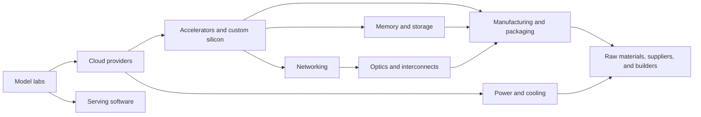
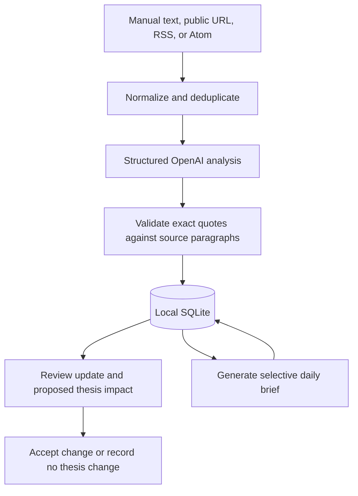

# Relay

Relay is a personal, evidence-backed AI infrastructure intelligence dashboard.
It answers one question clearly: **what changed across the AI infrastructure
stack, why does it matter, and should that change an existing company thesis?**

Relay is not a generic AI news feed. It connects exact source claims to
infrastructure layers, companies, dependencies, and proposed thesis impacts,
then produces a selective daily synthesis of the most material signals.

## The infrastructure map

Modern AI systems depend on much more than model labs or accelerator vendors.
Relay maps the companies, suppliers, and builders behind the full stack:



This is a dependency graph rather than a strictly linear supply chain. A signal
in one layer can strengthen one company while weakening another. For example,
tighter optics supply could benefit optical component vendors, constrain
network deployment, and change the economics of accelerator clusters.

Initial areas of coverage include:

- **Model labs:** OpenAI, Anthropic, Google, Meta
- **Cloud providers:** AWS, Microsoft Azure, Google Cloud, Oracle
- **Accelerators and custom silicon:** NVIDIA, AMD, Broadcom, Marvell
- **Memory:** Micron, SK Hynix, Samsung
- **Networking:** Arista, Broadcom, Marvell
- **Optics:** Coherent, Lumentum, Corning
- **Power and cooling:** Vertiv, Eaton, GE Vernova
- **Manufacturing and packaging:** TSMC and its upstream suppliers
- **Serving software:** inference runtimes, compilers, schedulers, and releases
- **Materials and builders:** substrates, wafers, specialty materials,
  equipment, construction, and grid infrastructure

The built-in watchlist is NVDA, AMD, AVGO, MRVL, ANET, COHR, LITE, GLW, MU,
VRT, ETN, GEV, and TSM.

## Current MVP

The repository contains a working local-first application:

- **Today** presents one lead signal, secondary signals, affected theses, and
  source evidence.
- **Updates** provides a filterable research console with grounded summaries,
  materiality, beneficiaries, threats, next signals, exact quotes, and a
  human-review decision.
- **Stack** visualizes layer dependencies and watchlist exposure.
- **Companies** provides thesis cards and company detail pages with confirmation
  signals, break conditions, metrics, and linked evidence.
- **Sources** imports authorized research, refreshes enabled public feeds, shows
  ingestion health, and generates a new daily brief.
- **Search** opens with `Cmd+K` or `Ctrl+K` and searches the currently loaded
  companies, updates, and stack layers.

The responsive dark interface uses a collapsible desktop navigation rail and
drawer-based inspectors on narrower screens.

## Intelligence workflow



For live imports, Relay separates:

1. **Source claims** — verbatim quotes validated against normalized source
   paragraphs and stored with paragraph locators.
2. **Classification** — affected stack layers and watchlist companies.
3. **Inference** — what happened, why it matters, who benefits, who is
   threatened, and what to watch next.
4. **Assessment** — materiality and sentiment, with confidence and time horizon
   on proposed company impacts.
5. **Review state** — proposed impacts stay proposed until accepted or rejected.

An accepted decision records approval on the proposed impact. It does not
silently rewrite the underlying company thesis.

## Data sources

### Implemented

- **Manual text:** paste an article, transcript, filing excerpt, research note,
  or other text you are authorized to process. Content is limited to 250,000
  characters.
- **Manual public URL:** Relay fetches public HTML or plain text, extracts the
  readable article body, and analyzes it. Title and publisher are still required
  in the current import form.
- **RSS and Atom:** the public-feed refresh supports both formats and analyzes
  content supplied in each feed entry.

The enabled feed registry currently includes:

- arXiv `cs.DC`
- The Next Platform
- vLLM GitHub release Atom feed
- SGLang GitHub release Atom feed

Refreshes process at most four entries by default, across all enabled feeds.
Set `RELAY_REFRESH_MAX_ITEMS` from 1 to 12 to change that cap. Exact duplicate
documents are deduplicated using their canonical URL and content hash.

### Not automated

Investor-relations pages and SEC EDGAR appear in the source catalog as planned
or manual sources, but Relay does not automatically crawl them. Import their
public pages or authorized text manually. There is no automated PDF parser,
file upload, authenticated/paywalled scraper, earnings-call adapter, SEC filing
adapter, or GitHub API integration. GitHub releases currently arrive through
public Atom feeds only.

Relay never bypasses a paywall or access control. If you import paid research,
you are responsible for having the right to process it and for keeping it
private.

## Demo data and live data

A new database is seeded with the ten-layer map, 13 watchlist companies, source
catalog entries, seven example updates, and one example daily brief so every
screen is immediately usable.

Seed records are product fixtures, not a live market-data feed:

- Seed updates and the seed brief have a `null` model field and are labeled
  **Seed data** in the interface.
- Example quotes and conclusions have not been independently verified and must
  not be treated as current research.
- Live imports store the configured OpenAI model name and coexist with the seed
  records.
- Seed records are inserted only when their IDs are absent; restarting Relay
  does not erase imports or review decisions.

Because seed and live records coexist, the seed-data banner remains visible
while any seed update is present.

## Technical stack

- React 19, React Router, Vite, and TypeScript
- Tailwind CSS 4 with project tokens in `src/client/styles.css`
- Hono on the Node.js HTTP server
- Node's built-in SQLite driver in WAL mode
- OpenAI Responses API with strict Zod structured outputs
- Mozilla Readability, RSS/Atom parsing, and hardened remote fetching
- Vitest and ESLint

The application is one TypeScript project. Client routes live under
`src/client/routes`, reusable product features under `src/client/features`, API
and services under `src/server`, shared contracts under `src/shared`, and local
runtime data under `data`.

## Requirements

- Node.js 22 or newer
- npm 10 or newer
- An OpenAI API key for live source analysis and brief generation

## Local setup

```bash
npm install
cp .env.example .env
```

Set `OPENAI_API_KEY` in `.env`, then start both the Vite client and Hono API:

```bash
npm run dev
```

Open `http://127.0.0.1:5173`. The API runs at
`http://127.0.0.1:8787` and Vite proxies `/api` during development.

Without a valid API key, the seeded dashboard still works, but source analysis,
feed refresh analysis, and brief generation will fail. Import metadata and
content may still be saved locally before an analysis failure is reported.

To build and run the production bundle locally:

```bash
npm run build
NODE_ENV=production npm start
```

The production server serves both the API and the built client from
`http://127.0.0.1:8787`.

## Environment variables

| Variable | Default | Purpose |
| --- | --- | --- |
| `OPENAI_API_KEY` | none | Required for live analysis and synthesis. Keep it server-side and never commit it. |
| `OPENAI_ANALYSIS_MODEL` | `gpt-5.4-mini` | Structured source analysis model. |
| `OPENAI_SYNTHESIS_MODEL` | `gpt-5.5` | Structured daily-brief model. |
| `HOST` | `127.0.0.1` | API bind address. Keep this on loopback unless you add an authentication and TLS boundary. |
| `PORT` | `8787` | API and production web-server port. |
| `RELAY_ALLOWED_HOSTS` | `127.0.0.1,localhost,::1` | Comma-separated API request-host allowlist. This is not authentication. |
| `RELAY_REFRESH_MAX_ITEMS` | `4` | Maximum feed entries analyzed per manual refresh; clamped to 1–12. |
| `RELAY_DATABASE_PATH` | `data/relay.sqlite` | Optional path for the local SQLite database. |

Both OpenAI requests use `store: false`. Source content still leaves the local
machine when Relay sends it to the configured OpenAI model, so do not process
material whose license or sensitivity prohibits that use.

## Commands

| Command | Purpose |
| --- | --- |
| `npm run dev` | Run client and API in watch mode. |
| `npm run dev:web` | Run only the Vite client. |
| `npm run dev:api` | Run only the API in watch mode. |
| `npm run test` | Run the Vitest suite once. |
| `npm run lint` | Run ESLint with zero warnings allowed. |
| `npm run typecheck` | Type-check the client project. |
| `npm run build` | Build the client and server. |
| `npm run start` | Start the compiled server; set `NODE_ENV=production` to serve the built client too. |
| `npm run check` | Run lint, type-check, tests, and both production builds. |

## Local data, backup, and reset

The default database is `data/relay.sqlite`; SQLite may also create
`data/relay.sqlite-wal` and `data/relay.sqlite-shm`. The database, imported
source text, generated analysis, review decisions, and generated briefs are
persisted there and ignored by Git. Database files are restricted to the current
OS user where the filesystem supports Unix permissions.

For a consistent file-level backup, stop Relay and copy all SQLite files:

```bash
mkdir -p backups/relay
cp data/relay.sqlite* backups/relay/
```

Keep backups private and untracked. Restore only while Relay is stopped, and
restore the database together with any matching WAL/SHM files from the same
snapshot.

To intentionally reset all local research and return to the seed catalog, stop
Relay and run:

```bash
rm -f data/relay.sqlite data/relay.sqlite-wal data/relay.sqlite-shm
npm run dev
```

The next server start recreates the schema and demo records. There is no in-app
backup, restore, export, or reset control.

## Security boundary

- The development servers and API bind to loopback by default.
- Relay has **no login, user accounts, authorization, or TLS**. Loopback is the
  access boundary; do not expose it directly to a LAN or the public internet.
- API writes reject cross-site requests, and API requests must use an allowed
  hostname. These defenses do not replace authentication.
- Public URL fetching allows only credential-free HTTP(S), rejects private and
  reserved destinations, revalidates redirects, pins the validated public IP,
  limits redirects, body size, content type, and request duration, and reduces
  SSRF and DNS-rebinding risk.
- API request bodies are size-limited. The server applies a restrictive content
  security policy and other secure response headers.
- `.env`, credentials, databases, imported documents, and local analysis are
  ignored by Git. CI uses read-only repository permissions, and Dependabot
  monitors npm and GitHub Actions dependencies.

Review `SECURITY.md` before changing network exposure or data handling. Never
commit paid research, API keys, session tokens, generated databases, or source
material that cannot be redistributed.

## Known limitations

- Feed refresh and daily synthesis are manual UI actions; there is no scheduler,
  job queue, background worker, or automatic retry.
- Feed analysis uses the text present in RSS/Atom entries and does not
  automatically fetch each linked full article.
- Sources are defined in code. The UI cannot add, edit, enable, or disable feed
  definitions.
- PDF ingestion, local file upload, authenticated sources, and automated
  investor-relations or SEC ingestion are not implemented.
- Company theses and the watchlist are seeded in code and are read-only in the
  UI. Accepting an impact changes its review state; it does not update the
  company thesis or create a thesis-revision history.
- Review decisions apply to all proposed impacts attached to the selected
  update.
- Search is client-side over the loaded dashboard payload, not a persisted
  full-text index.
- Deduplication catches exact normalized URL/content matches, not every
  syndicated or semantically equivalent report.
- There is no multi-user access, cloud sync, notification system, portfolio
  accounting, market-price data, or automated backup.
- Model availability, latency, output quality, and API cost depend on the
  configured OpenAI account and selected models.

Relay is a research organization tool, not financial advice.
